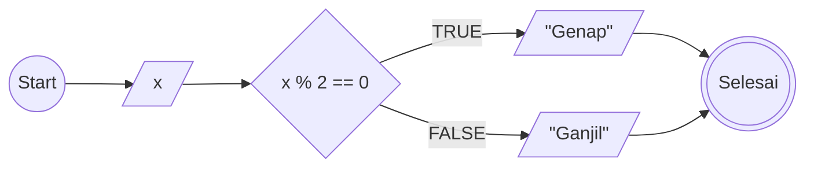

# Mini-task Algoritma

This is a bare minimum usage of algoritma, according to mini task on **Day 2** (15/042025)

1. Mulai
2. Tentukan nilai x
3. Jika angka habis dibagi 2, maka
4. Angka tersebut adalah genap
5. Jika tidak, maka
6. Angka tersebut ganjil
7. Selesai



```Pseudocode

// Ganjil Genap

DECLARE x : INT
DECLARE RESULT : STRING

INPUT x

IF  x MOD 2==0  THEN
    RESULT <-- "Genap"
ELSEIF
    RESULT <-- "Ganjil"
ENDIF

OUTPUT Result

```
