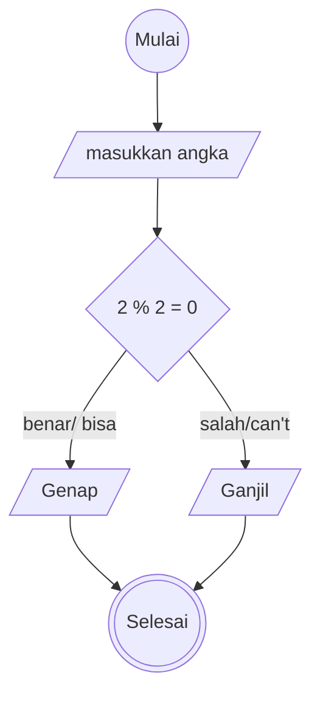

# Mini-task Algoritma

This is a bare minimum usage of algoritma, according to mini task on **Day 2** (15/042025)

## Algoritma menentukan bilangan ganjil dan genap

1. mulai
2. siapkan angka 1-10
3. apabila angka 1-10 ada yang bisa di bagi 2 dan hasil sisah baginya 0
4. maka sebut angka tersebut sebagai bilangan genap
5. apabila angka 1-10 dibagi 2 dan hasil sisah baginya 1
6. maka sebut angka tersebut sebagai bilangan ganjil
7. selesai

## yang benar

1. Mulai
2. Tentukan angka
3. Jika angka habis dibagi 2, maka
4. Angka tersebut adalah genap
5. Jika tidak, maka
6. Angka tersebut ganjil
7. Selesai

