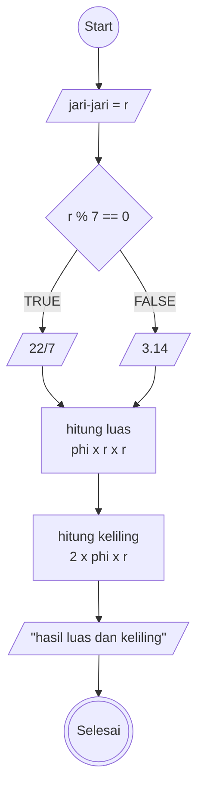

# Mini-task Algoritma

This is a bare minimum usage of algoritma, according to mini task on **Day 2** (15/042025)

## Algoritma menghitung luas dan keliling lingkaran

1. mulai
2. masukkan jari jari sebagai r
3. jika "r" habis dibagi 7, maka gunakan "phi" sebagai 22/7
4. jika tidak, gunakan "phi" sebagai 3.14
5. hitung luas dengan "phi" dikali r kuadrat
6. hitung keliling dengan 2 dikali "phi" dikali r
7. selesai

## Flowcahrt



```pseudocode
// luas lingkaran

DECLARE r: REAL
DECLARE phi: REAL
DECLARE luas: REAL
DECLARE keliling: REAL

INPUT r

IF r%7== 0 THEN
    phi <-- 22/7
ELSEIF
    phi <-- 3.14
ENDIF

luas <-- r x phi x r x r
keliling <-- r x 2 x phi x r

OUTPUT "hasil dari luas lingkaran adalah:", luas
OUTPUT "hasil dari keliling lingkaran adalah:", keliling

```
