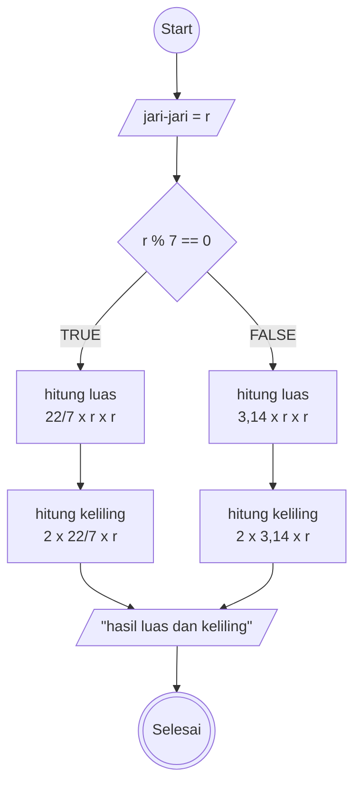

# Mini-task Algoritma

This is a bare minimum usage of algoritma, according to mini task on **Day 2** (15/042025)

## Algoritma menghitung luas lingkaran

1. Mulai
2. tentukan angka jari- jari lingkaran
3. apabila jari-jari kelipatan 7, maka
4. gunakan rumus pi(22/7) x r x r
5. jika jari jari bukan kelipatan 7, maka
6. gunakan rumus pi(3,14) x r x r
7. hitung luas lingkaran
8. mendapatkan hasil
9. selesai

## Algoritma menghitung keliling lingkaran

1. Mulai
2. tentukan angka jari- jari lingkaran
3. apabila jari-jari kelipatan 7, maka
4. gunakan rumus 2 x pi(22/7) x r
5. jika jari jari bukan kelipatan 7, maka
6. gunakan rumus 2 x pi(3,14) x r
7. hitung luas lingkaran
8. mendapatkan hasil
9. selesai

## yang benar

1. mulai
2. masukkan jari jari sebagai r
3. jika "r" habis dibagi 7, maka gunakan "phi" sebagai 22/7
4. jika tidak, gunakan "phi" sebagai 3.14
5. hitung luas dengan "phi" dikali r kuadrat
6. hitung keliling dengan 2 dikali "phi" dikali r
7. selesai

## Flowcahrt

