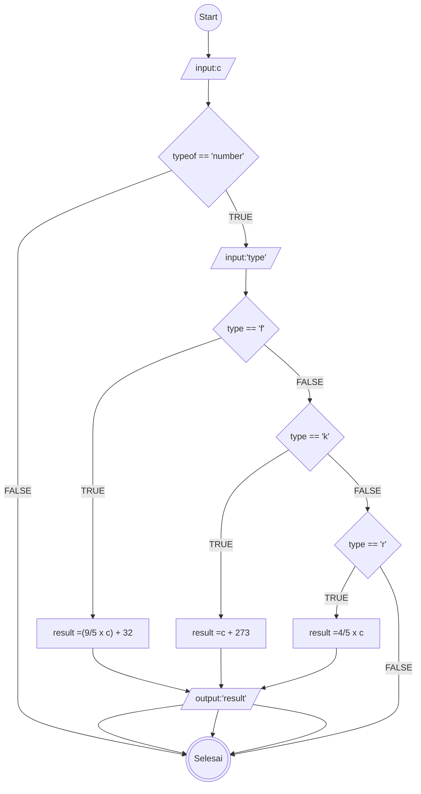

# Mini-task Algoritma

This is a bare minimum usage of algoritma, according to mini task on **Day 2** (15/042025)

## Algoritma mengkonversikan suhu celcius

1. Mulai
1. masukkan suhu sebagai "c"
1. jika "typeof" == "number", maka
1. masukkan tipe konversi yang di pilih sebagai "type"
1. jika "type" diisikan "f", maka
1. hitung "result" dengan (9/5 x c) + 32
1. jika "type" diisikan "k", maka
1. hitung "result" dengan c + 273
1. jika "type" diisikan "r", maka
1. hitung "result" dengan 4/5 x c
1. output result
1. selesai

