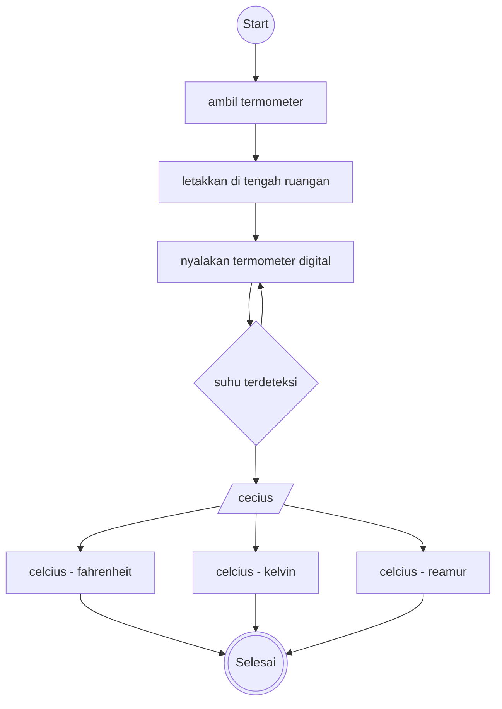

# Mini-task Algoritma

This is a bare minimum usage of algoritma, according to mini task on **Day 2** (15/042025)

## Algoritma mengkonversikan suhu celcius

1. Mulai
1. ambil termometer digital
1. letakkan di tengah ruangan, jauh dari dinding dan sumber panas atau dingin
1. nyalakan termometer digital
1. jika suhu sudah terdeteksi celcius, maka
1. ubah suhu dari celcius ke fahrenheit (⁰F = (9/5) × ⁰C + 32)
1. ubah suhu dari celcius ke kelvin (K= ⁰C + 273,15)
1. ubah suhu dari celcius ke reamur (⁰R = (4/5) ⁰C)
1. hasil
1. selesai

